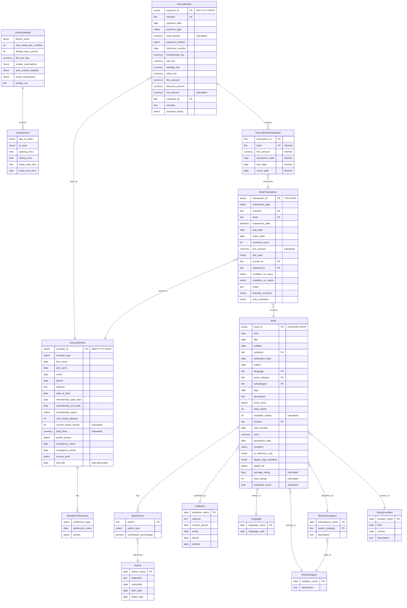

## Detailed DocType Relationships & Data Flow

### Entity Relationship Diagram (ERD)

```mermaid
erDiagram
    %% Settings & Configuration
    LibrarySettings {
        string library_name
        int max_books_per_member
        int default_issue_period
        currency fine_per_day
        check enable_reservations
        check auto_extend_enabled
        check email_notifications
        link holiday_list
    }
    
    LibraryHours {
        select day_of_week
        check is_open
        time opening_time
        time closing_time
        time break_start_time
        time break_end_time
    }
    
    %% Master Entities
    Author {
        data author_name PK
        text biography
        data nationality
        date birth_date
        date death_date
    }
    
    Publisher {
        data publisher_name PK
        text address
        data contact_person
        data email
        data phone
        data website
    }
    
    Language {
        data language_name PK
        data language_code
    }
    
    BookCategory {
        data category_name PK
        text description
    }
    
    BookSubcategory {
        data subcategory_name PK
        link parent_category FK
        text description
    }
    
    LibraryLocation {
        data location_name PK
        data floor
        data section
        text description
    }
    
    Book {
        series book_id PK "LIB-BOOK-#####"
        data isbn
        data title
        data subtitle
        link publisher FK
        date publication_date
        data edition
        link language FK
        link book_category FK
        link subcategory FK
        data tags
        text description
        attach book_cover
        int total_copies
        int available_copies "calculated"
        link location FK
        data rack_number
        currency price
        date acquisition_date
        select condition
        check is_reference_only
        check digital_copy_available
        attach digital_file
        float average_rating "calculated"
        int total_ratings "calculated"
        float popularity_score "calculated"
    }
    
    BookAuthor {
        link author FK
        select author_type
        percent contribution_percentage
    }
    
    LibraryMember {
        series member_id PK "MEM-YYYY-#####"
        select member_type
        data first_name
        data last_name
        data email
        data phone
        text address
        date date_of_birth
        date membership_start_date
        date membership_end_date
        select membership_status
        int max_books_allowed
        int current_books_issued "calculated"
        currency total_fines "calculated"
        attach profile_picture
        data emergency_name
        data emergency_phone
        select access_level
        data barcode "auto-generated"
    }
    
    MemberPreferences {
        select preference_type
        data preference_value
        select priority
    }
    
    %% Transaction Entities
    BookTransaction {
        series transaction_id PK "TXN-#####"
        select transaction_type
        link member FK
        link book FK
        datetime transaction_date
        date due_date
        date return_date
        int renewed_count
        currency fine_amount "calculated"
        check fine_paid
        link issued_by FK
        link returned_to FK
        select condition_on_issue
        select condition_on_return
        text notes
        check barcode_scanned
        check auto_extended
    }
    
    FeeCollection {
        series payment_id PK "PAY-YYYY-#####"
        link member FK
        date payment_date
        select payment_type
        currency total_amount "calculated"
        select payment_method
        data reference_number
        currency membership_fee
        currency late_fee
        currency damage_fee
        currency other_fee
        currency fine_amount
        currency discount_amount
        currency net_amount "calculated"
        link collected_by FK
        text remarks
        select payment_status
    }
    
    FeeCollectionFineDetail {
        link transaction_id FK
        link book FK "fetched"
        currency fine_amount "fetched"
        date transaction_date "fetched"
        date due_date "fetched"
        date return_date "fetched"
    }
    
    %% Relationships
    LibrarySettings ||--o{ LibraryHours : contains
    
    Book ||--o{ BookAuthor : has
    BookAuthor }o--|| Author : references
    Book }o--|| Publisher : published_by
    Book }o--|| Language : written_in
    Book }o--|| BookCategory : belongs_to
    Book }o--|| BookSubcategory : classified_as
    Book }o--|| LibraryLocation : located_at
    BookSubcategory }o--|| BookCategory : child_of
    
    LibraryMember ||--o{ MemberPreferences : has
    
    BookTransaction }o--|| LibraryMember : issued_to
    BookTransaction }o--|| Book : involves
    
    FeeCollection }o--|| LibraryMember : paid_by
    FeeCollection ||--o{ FeeCollectionFineDetail : contains
    FeeCollectionFineDetail }o--|| BookTransaction : references
```