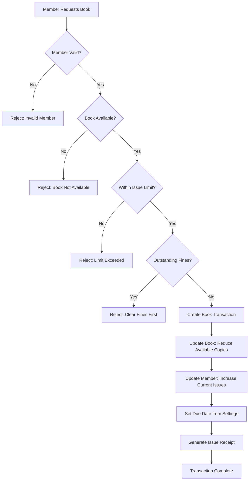
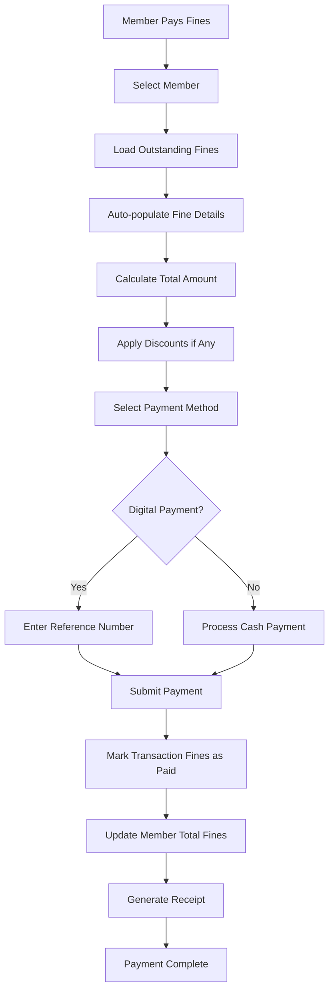
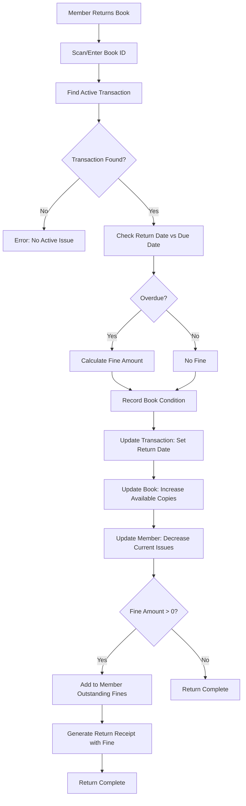

## Data Flow Diagrams

### Book Issue Process Flow

```mermaid
flowchart TD
    A[Member Requests Book] --> B{Member Valid?}
    B -->|No| C[Reject: Invalid Member]
    B -->|Yes| D{Book Available?}
    D -->|No| E[Reject: Book Not Available]
    D -->|Yes| F{Within Issue Limit?}
    F -->|No| G[Reject: Limit Exceeded]
    F -->|Yes| H{Outstanding Fines?}
    H -->|Yes| I[Reject: Clear Fines First]
    H -->|No| J[Create Book Transaction]
    J --> K[Update Book: Reduce Available Copies]
    K --> L[Update Member: Increase Current Issues]
    L --> M[Set Due Date from Settings]
    M --> N[Generate Issue Receipt]
    N --> O[Transaction Complete]
```

### Fine Collection Process Flow

```mermaid
flowchart TD
    A[Member Pays Fines] --> B[Select Member]
    B --> C[Load Outstanding Fines]
    C --> D[Auto-populate Fine Details]
    D --> E[Calculate Total Amount]
    E --> F[Apply Discounts if Any]
    F --> G[Select Payment Method]
    G --> H{Digital Payment?}
    H -->|Yes| I[Enter Reference Number]
    H -->|No| J[Process Cash Payment]
    I --> K[Submit Payment]
    J --> K
    K --> L[Mark Transaction Fines as Paid]
    L --> M[Update Member Total Fines]
    M --> N[Generate Receipt]
    N --> O[Payment Complete]
```

### Book Return Process Flow

```mermaid
flowchart TD
    A[Member Returns Book] --> B[Scan/Enter Book ID]
    B --> C[Find Active Transaction]
    C --> D{Transaction Found?}
    D -->|No| E[Error: No Active Issue]
    D -->|Yes| F[Check Return Date vs Due Date]
    F --> G{Overdue?}
    G -->|Yes| H[Calculate Fine Amount]
    G -->|No| I[No Fine]
    H --> J[Record Book Condition]
    I --> J
    J --> K[Update Transaction: Set Return Date]
    K --> L[Update Book: Increase Available Copies]
    L --> M[Update Member: Decrease Current Issues]
    M --> N{Fine Amount > 0?}
    N -->|Yes| O[Add to Member Outstanding Fines]
    N -->|No| P[Return Complete]
    O --> Q[Generate Return Receipt with Fine]
    Q --> R[Return Complete]
```